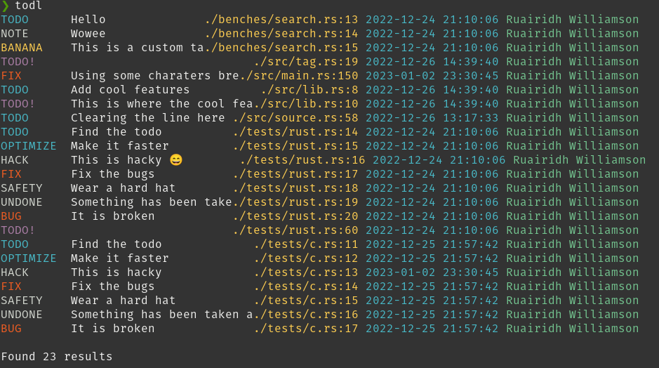

# TODL

[](https://crates.io/crates/todl)
[](https://github.com/RuairidhWilliamson/todl/blob/main/LICENSE.md)
[](https://docs.rs/todl)

A tool that finds comment tags in source code.

Do you like leaving todo comments in your code but want a way to easily find them? Use grep! But if you want different kinds of tags (optimize, fix, bug, etc...), want more information (when comments were last changed) or you are just lazy then todl can help.

## Install
You can install todl as a cli tool
```
cargo install todl
```

## Usage

To search the current directory
```
todl
```

Example output (width is determined by your terminal)


## FAQs
### What are comment tags?

Comment tags are labels at the start of comments to make it easier to find and convey meaning.
```
// TODO: Make this function do something
fn foo() -> u32 {
    0
}
```

[Wikipedia Comment Tags](https://en.wikipedia.org/wiki/Comment_(computer_programming)#Tags)

### What comment tags are supported?

C style comments and rust `todo!()` macros.

Supported tags include (case insensitive):

```
todo
bug
debug
fix
fixme
note
nb
undone
hack
bodge
kludge
xxx
optimize
optimizeme
optimise
optimiseme
safety
invariant
lint
ignored
```

### What if my comments aren't supported?

There is support for custom tags but if you are using a language that is not currently supported raise an issue for it here [issues](https://github.com/RuairidhWilliamson/todl/issues).


## Limitations

- Currently only supports rust and c-like syntax
- Does not exclude strings
- The message extracted after the comment tag only includes the first line

## Alternatives

Check out these tools that do similar things
- [cargo-todo](https://crates.io/crates/cargo-todo)
- [todo-ci](https://crates.io/crates/todo-ci)

